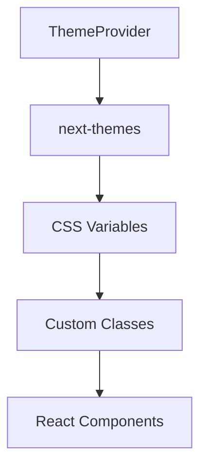

# Theme System Documentation

## Overview

This project uses **CSS Variables + Custom Classes** approach for theme management instead of hard-coding Tailwind's `dark:` classes. This provides better maintainability, scalability, and follows industry best practices.

## Architecture



## CSS Variables

### Light Theme (Default)

```css
:root {
  --foreground: #111827; /* Primary text */
  --text-secondary: #6b7280; /* Secondary text */
  --text-tertiary: #9ca3af; /* Tertiary text */
  --card-bg: #ffffff; /* Card backgrounds */
  --input-bg: #ffffff; /* Input backgrounds */
  --border-color: #e5e7eb; /* General borders */
  --input-border: #d1d5db; /* Input borders */
  --icon-color: #6b7280; /* Icon colors */
  --link-color: #3b82f6; /* Link colors */
  --link-hover: #2563eb; /* Link hover */
  --divider-color: #e5e7eb; /* Dividers */
  --shadow: 0 1px 3px 0 rgba(0, 0, 0, 0.1)...;
}
```

### Dark Theme

```css
.dark {
  --foreground: #f9fafb; /* Primary text */
  --text-secondary: #d1d5db; /* Secondary text */
  --text-tertiary: #9ca3af; /* Tertiary text */
  --card-bg: #1f2937; /* Card backgrounds */
  --input-bg: #374151; /* Input backgrounds */
  --border-color: #374151; /* General borders */
  --input-border: #4b5563; /* Input borders */
  --icon-color: #9ca3af; /* Icon colors */
  --link-color: #60a5fa; /* Link colors */
  --link-hover: #93c5fd; /* Link hover */
  --divider-color: #4b5563; /* Dividers */
  --shadow: 0 1px 3px 0 rgba(0, 0, 0, 0.3)...;
}
```

## Custom Classes

### Text Classes

- `.text-primary` - Primary text color (--foreground)
- `.text-secondary` - Secondary text color (--text-secondary)
- `.text-tertiary` - Tertiary text color (--text-tertiary)
- `.text-icon` - Icon color (--icon-color)
- `.text-link` - Link color with hover (--link-color)

### Background Classes

- `.bg-card` - Card background (--card-bg)
- `.bg-input` - Input background (--input-bg)

### Border Classes

- `.border-theme` - General border (--border-color)
- `.border-input` - Input border (--input-border)

### Form Classes

- `.form-input` - Complete input styling with hover/focus states
- `.btn-social` - Social button styling with hover states

### Utility Classes

- `.divider-theme` - Divider styling (--divider-color)
- `.shadow-theme` - Theme-aware shadow (--shadow)

## Usage Examples

### Before (Hard-coded)

```tsx
❌ Hard-coded approach
<h2 className="text-gray-800 dark:text-gray-100 transition-colors duration-200">
  Welcome
</h2>
<input className="border-gray-300 dark:border-gray-600 dark:bg-gray-700 dark:text-gray-100" />
```

### After (CSS Variables + Custom Classes)

```tsx
✅ Maintainable approach
<h2 className="text-primary">
  Welcome
</h2>
<input className="form-input" />
```

## Benefits

### 1. Maintainability

- ✅ Single source of truth for colors
- ✅ Easy to modify theme colors
- ✅ No need to search/replace across files

### 2. Scalability

- ✅ Easy to add new themes (e.g., blue, green)
- ✅ Consistent color usage across components
- ✅ Reusable class names

### 3. Performance

- ✅ No runtime class concatenation
- ✅ Smaller bundle size (fewer classes)
- ✅ Better CSS caching

### 4. Developer Experience

- ✅ Shorter class names
- ✅ Self-documenting (`.text-primary` vs `.text-gray-800 dark:text-gray-100`)
- ✅ IDE autocomplete support

## Adding New Themes

### Step 1: Add CSS Variables

```css
.theme-blue {
  --foreground: #1e3a8a;
  --text-secondary: #3b82f6;
  /* ... other variables */
}
```

### Step 2: Update ThemeProvider

```tsx
<ThemeProvider themes={["light", "dark", "blue"]}>
```

### Step 3: Components automatically inherit new theme

No changes needed in components!

## Best Practices

### ✅ Do

- Use semantic class names (`.text-primary` not `.text-gray-800`)
- Define all colors as CSS variables
- Use custom classes for repeated patterns
- Keep transitions in CSS, not inline

### ❌ Don't

- Mix hard-coded colors with theme variables
- Use `dark:` classes for theme-aware elements
- Inline CSS variables in JSX
- Override theme variables with `!important`

## Migration Guide

### From Hard-coded Classes

```tsx
// Before
className = "text-gray-800 dark:text-gray-100";

// After
className = "text-primary";
```

### From Inline Styles

```tsx
// Before
style={{ color: theme === 'dark' ? '#f9fafb' : '#111827' }}

// After
className="text-primary"
```

## File Structure

```
src/
├── app/
│   └── globals.css          # CSS variables and custom classes
├── components/
│   ├── ThemeDemo.tsx        # Demo component (remove in production)
│   └── providers/
│       └── AntdThemeProvider.tsx  # Ant Design integration
└── docs/
    └── THEME_SYSTEM.md      # This documentation
```

## Integration with Ant Design

The `AntdThemeProvider` automatically syncs Ant Design components with our CSS variables:

```tsx
const antdTheme = {
  algorithm: isDark ? theme.darkAlgorithm : theme.defaultAlgorithm,
  token: {
    colorText: isDark ? "#f9fafb" : "#111827",
    colorBgContainer: isDark ? "#1f2937" : "#ffffff",
    // ... other tokens mapped to CSS variables
  },
};
```

This ensures consistency between custom components and Ant Design components.
